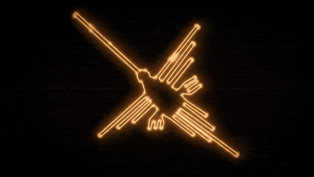
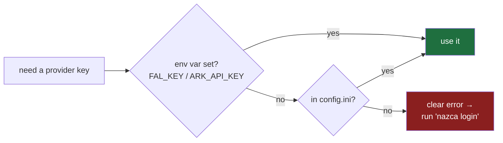
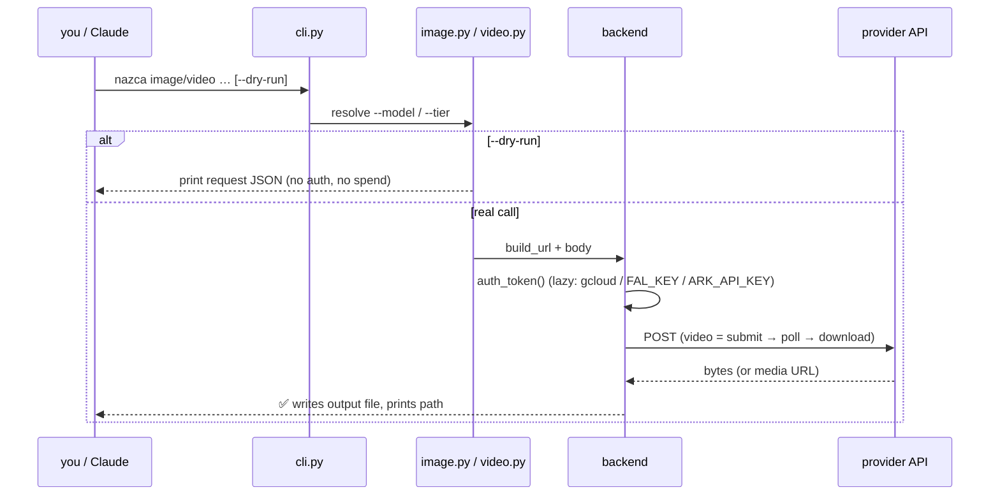

# nazca

<p align="center">
  
</p>

<p align="center"><em>the lines that draw themselves — image &amp; video generation, for agents</em></p>

**nazca** is a thin, **agent-driven CLI** for AI **image** and **video** generation.
Two commands, each does one thing and prints the output path. Claude (or you) writes
the prompt and judges the result — nazca is just clean, reliable access to the models.

```bash
nazca image -o dish.png --ref photo.jpg -p "restyle: warm amber parrilla grade"
nazca video -o clip.mp4 -s start.png -p "slow push-in, embers glow" --tier cheap
```

> **Why "nazca"?** The [Nazca Lines](https://en.wikipedia.org/wiki/Nazca_Lines) are enormous figures —
> a hummingbird, a monkey, a spider — drawn into the Peruvian desert ~2,000 years ago: one of humanity's
> oldest acts of image-making at scale. This is the modern instrument for it: a prompt in, an image or video out.

---

## Contents

- [How it works](#how-it-works)
- [Install](#install)
- [Quickstart](#quickstart)
- [Commands](#commands) — [`image`](#nazca-image) · [`video`](#nazca-video)
- [Models & cost](#models--cost) — the `--tier` shortcut + price table
- [Credentials](#credentials) — `nazca login`, precedence, per-provider setup
- [Custom / overriding models](#custom--overriding-models)
- [Use with Claude Desktop (MCP)](#use-with-claude-desktop-mcp)
- [Design & architecture](#design--architecture)
- [Limitations](#limitations)

---

## How it works

One prompt → nazca picks a model → routes to the right provider backend → writes a file.


**Direct-first.** Google models always go straight to Vertex — the cheapest path, no API key. fal and
ModelArk are *dotted* because they're opt-in: a Vertex-only run never reaches for their keys.

---

## Install

One command installs the global `nazca` CLI:

```bash
pipx install "git+https://github.com/Mysios-Labs-inc/nazca.git"
```

Then authenticate the default (Google) path — no API key needed:

```bash
gcloud auth login
nazca --help    # image · video · login · config · models
```

<details>
<summary><b>Prerequisites & options</b></summary>

- **Python ≥ 3.10** + the [Google Cloud SDK](https://cloud.google.com/sdk/docs/install) (`gcloud`) for the Vertex path.
- **No `pipx`?** `brew install pipx` (macOS) or `python3 -m pip install --user pipx`.
- **Private repo / SSH:** `pipx install "git+ssh://git@github.com/Mysios-Labs-inc/nazca.git"`
- **Arrow-key login UI** (optional): `pipx install "nazca[tui] @ git+https://github.com/Mysios-Labs-inc/nazca.git"`
- **`uv` user?** `uv tool install "git+https://github.com/Mysios-Labs-inc/nazca.git"`

</details>

<details>
<summary><b>Development (clone + editable install)</b></summary>

```bash
git clone https://github.com/Mysios-Labs-inc/nazca.git && cd nazca
python3 -m venv .venv && . .venv/bin/activate
pip install -e ".[tui]"     # core (click + Pillow) + optional arrow-key UI
```

</details>

---

## Quickstart

```bash
gcloud auth login                                                    # 1. one-time auth (Vertex, no key)
nazca image -o test.png -p "a rustic Peruvian parrilla scene" --dry-run   # 2. preview — spends nothing
nazca image -o dish.png -p "grilled anticuchos, warm amber light, 9:16"   # 3. make a real image
nazca video -o dish.mp4 -s dish.png -p "slow push-in, embers glow" --tier cheap   # 4. animate it
```

> **The golden rule:** every command takes **`--dry-run`** — it prints the exact request and **spends
> nothing**. Use it to confirm your setup before any real call.

| I want to… | do this |
|---|---|
| see all commands | `nazca --help` |
| see a command's flags | `nazca image --help` |
| preview without spending | add `--dry-run` |
| let nazca pick the cheap model | add `--tier cheap` |
| restyle a real photo | `nazca image -o out.png --ref photo.jpg -p "..."` |
| store a fal / ModelArk key | `nazca login` |
| list available models | `nazca models` |

nazca makes **clean media only** — no baked-in text/logos (overlays belong in Figma). Google/Vertex
models (the defaults) are proven live; fal is dry-run-tested; ModelArk needs [console activation](#bytedance-modelark-opt-in).

---

## Commands

### `nazca image`

Generate an image, or **restyle a real photo** with `--ref` (image-to-image — keep the real subject,
change the look).

```bash
# restyle a real product photo (recommended)
nazca image -o out.png --ref dish.jpg -p "warm amber/ochre grade, side-back key, honey-stained wood"

# multiple references (nano-banana-pro takes up to 14 — subject + style refs)
nazca image -o out.png --model nano-banana-pro --ref dish.jpg --ref style.jpg -p "..."

# fresh text-to-image via Imagen
nazca image -o out.png --model imagen-4 -p "a rustic Peruvian parrilla scene, 9:16"
```

| `--model` | id | region | `--ref`? |
|---|---|---|---|
| `nano-banana` *(default)* | gemini-2.5-flash-image | us-central1 | ✅ |
| `nano-banana-2` | gemini-3.1-flash-image | global | ✅ |
| `nano-banana-pro` | gemini-3-pro-image | global | ✅ (≤14) |
| `imagen-4` · `imagen-4-fast` · `imagen-3` | imagen-4.0-\* / 3.0 | us-central1 | ❌ (text-to-image only) |

**Flags:** `-o/--out` · `-p/--prompt` · `--ref` (repeatable) · `--model` · `--aspect` (default `9:16`) ·
`--size 1K\|2K\|4K` (gemini-3 only) · `--tier cheap\|premium` · `--dry-run`.
Full Vertex inventory: [`docs/vertex-models.md`](docs/vertex-models.md).

### `nazca video`

Vertex **Veo 3.1** image-to-video. Start frame **+ optional end frame** (keyframe interpolation).
Submit → poll → download.

```bash
# single start frame + motion (best for camera moves)
nazca video -o clip.mp4 -s start.png -p "slow cinematic push-in, embers glow"

# cheapest 720p (veo-3.1-lite)
nazca video -o clip.mp4 -s start.png -p "..." --tier cheap

# start + end frame (keyframe — only when they're tight variants of each other)
nazca video -o clip.mp4 -s a.png --end b.png -p "the skewer lifts off the grill"
```

**Flags:** `-o/--out` · `-s/--start` · `-p/--prompt` · `--end` · `--model` (default `veo-3.1-fast`) ·
`--duration 4\|6\|8` · `--aspect 9:16\|16:9` · `--resolution 720p\|1080p` · `--audio` · `--tier` · `--dry-run`.

> Clips are **silent by default** (`--audio` adds sound and **doubles** Veo's cost). Keyframe interpolation
> **morphs** if the end frame isn't a tight variant of the start — use a single frame for camera moves.

---

## Models & cost

Don't memorize model ids — pass **`--tier cheap`** or **`--tier premium`** and nazca picks a sensible
Vertex-direct default. An explicit `--model` always wins over `--tier`.

```bash
nazca image -o out.png -p "..." --tier cheap      # → nano-banana
nazca video -o clip.mp4 -s a.png -p "..." --tier premium   # → veo-3.1
```

Prices are **official Google Cloud rates** (verified 2026-06-18). fal/ModelArk pricing changes often and
is tier/resolution-dependent — treat those as approximate and `--dry-run` first.

| model | kind | $/unit | tier | backend |
|---|---|---|---|---|
| `imagen-4-fast` | image | $0.02 / img | cheap | Vertex |
| `nano-banana` *(default)* | image | ~$0.039 / img | cheap | Vertex |
| `imagen-4` | image | $0.04 / img | premium | Vertex |
| `nano-banana-pro` | image | ~$0.134 / img @2K | premium | Vertex |
| `flux-schnell` | image | ~$0.003 / MP | cheap | fal |
| `seedream` | image | ~$0.035 / img | — | ModelArk |
| `veo-3.1-lite` | video | $0.05 / s (720p) | cheap | Vertex |
| `veo-3.1-fast` *(default)* | video | $0.10 / s (720p) | cheap | Vertex |
| `veo-3.1` | video | $0.20 / s · **+audio $0.40** | premium | Vertex |
| `wan-2.6`, `seedance-2-fast` | video | tier/res-dependent | cheap | fal |
| `seedance-lite`, `seedance-pro` | video | tier/res-dependent | cheap / premium | ModelArk |

Run **`nazca models`** anytime to print the live table (including your overrides).

---

## Credentials

Google/Vertex needs **no key** — `gcloud auth login` handles it. You only set keys to opt into fal or
ModelArk, and nazca stores them so you don't re-export env vars every shell.

### `nazca login`

Interactive setup — pick a provider, paste the key (hidden), repeat, done. The menu shows which keys
are already set:

```
? Select a provider to configure:  (↑↓)
   fal.ai  (FAL_KEY)                   ✗ not set
 ❯ ByteDance ModelArk  (ARK_API_KEY)   ✗ not set
   Vertex AI  (gcloud — no key needed) ✓ gcloud
   Done
```

```bash
nazca login                       # interactive (arrow keys with the [tui] extra, else numbered)
nazca config set fal_key sk-...   # set one key non-interactively
nazca config get fal_key          # masked value + where it resolved from
nazca config list                 # all keys, masked, with sources
```

Keys are written to `~/.config/nazca/config.ini` (dir `0700`, file `0600`). They're **never echoed** —
confirmations show a masked value like `sk...d999`. Never pass a key as a CLI flag (it leaks into shell
history); use `login` or an env var.

### Precedence: env var → config file



An env var always overrides the stored file — handy for CI or a one-off second account.

### Google Vertex (default — no key)

Runs on your gcloud credentials (short-lived token, nothing
persisted). Defaults: project `your-gcp-project`, region `us-central1`. Override via env:

| env var | default | purpose |
|---|---|---|
| `VERTEX_PROJECT` | `your-gcp-project` | GCP project (billing/credits) |
| `VERTEX_LOCATION` | `us-central1` | default region (some models are `global`) |
| `VEO_MODEL` | `veo-3.1-fast-generate-001` | default video model |
| `VEO_POLL_INTERVAL` / `VEO_POLL_MAX_TRIES` | `15` / `60` | video & fal polling cadence |

### fal.ai (opt-in — the long tail)

FLUX, Wan, and Seedance under one key; Google models **stay on
Vertex** (cheaper). Get a key at the fal.ai dashboard → `nazca login` → fal.ai. *Status: integration built,
not yet verified against a live key.*

### ByteDance ModelArk (opt-in)

A direct path to Seedream (image) and Seedance (video). Model IDs are
the real BytePlus ones and **confirmed recognized by the API** — but **each model must be activated in the
[BytePlus Ark console](https://console.byteplus.com/ark)** (region `ap-southeast`) before it will run, else
you get `ModelNotOpen` / `404`.

- Get a key at ark.bytepluses.com → `nazca login` → ByteDance ModelArk.
- **Activate** Seedream / Seedance in the console's *Model activation* page.
- Caveats: video output capped at **720p** (upscale in post); close-up faces may be refused; the billing
  dashboard lags. Benchmark vs fal before relying on it for cost (Seedance pricing is tier/resolution-dependent).

---

## Custom / overriding models

Provider model IDs change (deprecations, version bumps). You never have to edit source — three ways:

**1. `backend:rawid` prefix** — call any raw provider id directly:

```bash
nazca image --model "ark:seedream-4-5-251128" -o out.png -p "..."
nazca image --model "fal:fal-ai/flux/pro"     -o out.png -p "..."
nazca video --model "vertex:veo-3.2-fast-generate-001" -s a.png -o c.mp4 -p "..."
```

| prefix | backend | needs |
|---|---|---|
| `ark:` / `modelark:` | ModelArk | `ARK_API_KEY` |
| `fal:` | fal.ai | `FAL_KEY` |
| `vertex:` / `veo:` | Vertex | gcloud auth |

**2. `~/.config/nazca/models.json` override** — re-point a shorthand (or add one) without a release:

```json
{
  "image": { "seedream": { "id": "seedream-4-5-251128", "backend": "modelark", "tier": "premium" } },
  "video": { "seedance-lite": { "id": "bytedance-seedance-1-0-lite-i2v-250601", "backend": "modelark", "tier": "cheap" } }
}
```

**3. `nazca models`** — print the resolved table; user-overridden entries are marked `*`.

**Resolution order:** `backend:rawid` → `models.json` override → built-in defaults → raw passthrough.

---

## Use with Claude Desktop (MCP)

The same engine that powers the CLI is also exposed as an [MCP](https://modelcontextprotocol.io)
server, so the **Claude Desktop app** can generate images and video directly. The Desktop app
can't run arbitrary shell commands the way Claude Code can — it talks to tools through MCP — so
this server is the supported way to use nazca from Desktop.

It runs locally over stdio. Each user authenticates with their **own** Google credentials
(Application Default Credentials), plus optional `FAL_KEY` / `ARK_API_KEY` — exactly like the CLI.
Nothing is hosted or shared.

> **Distributing to a team?** Each teammate (with access to the private repo) runs the one-shot
> installer, which does steps 1–2 below and prints the config snippet for step 3:
> ```bash
> git clone https://github.com/Mysios-Labs-inc/nazca.git && cd nazca && ./scripts/install.sh
> ```
> (`scripts/install.sh` needs only `uv` + GitHub access.) Updates later: `uv tool upgrade nazca`.

**1. Install nazca with the `mcp` extra, then run setup** (one-time, per machine):

```bash
uv tool install "nazca[mcp] @ git+https://github.com/Mysios-Labs-inc/nazca.git"   # or, from a clone:  uv tool install ".[mcp]"
nazca setup                                           # installs gcloud if missing, then logs you in
```

`nazca setup` is interactive: it checks for the Google Cloud SDK and **offers to install it**
(Homebrew cask or the official script) if you don't have it, runs
`gcloud auth application-default login` (browser flow), and verifies a token mints. Use
`nazca setup -y` to skip the confirmations.

Auth note: with the `[mcp]` extra installed, nazca mints Vertex tokens from your ADC via the
`google-auth` library — **no `gcloud` binary needed at runtime**, so it works under Claude Desktop's
minimal-PATH subprocess launch. (Pure-CLI installs without the extra fall back to shelling
`gcloud`, probing common SDK locations; set `GCLOUD_BIN` if yours is unusual.) Your GCP project is
`VERTEX_PROJECT` (override via env var); the ADC login is what associates your own quota/billing.

**2. Register the server** in `claude_desktop_config.json`
(macOS: `~/Library/Application Support/Claude/claude_desktop_config.json`):

```json
{
  "mcpServers": {
    "nazca": { "command": "nazca-mcp" }
  }
}
```

If `nazca-mcp` isn't on Desktop's `PATH`, use its absolute path (`which nazca-mcp`) or run via uv:

```json
{
  "mcpServers": {
    "nazca": {
      "command": "uv",
      "args": ["run", "--directory", "/abs/path/to/mediagen", "nazca-mcp"]
    }
  }
}
```

Restart Claude Desktop. You'll get three tools: **`list_models`**, **`generate_image`**, and
**`generate_video`** — thin wrappers over the same `generate_image` / `generate_video` the CLI uses
(refs, tiers, `backend:rawid` passthrough, and `dry_run` all work identically).

**Output files**: a bare filename (e.g. `cat.png`) is written to the server's **current working
directory**, which Claude Desktop / Cowork set to the session folder where they surface files — so
the image/video appears in chat. Pass an absolute path to put it elsewhere, or set
`$NAZCA_OUTPUT_DIR` in the server config's `env` block to pin a fixed location (falls back to
`~/nazca-output` when the cwd isn't writable, e.g. a plain chat launch).

> Run it standalone to sanity-check before wiring Desktop: `nazca-mcp` (it will wait on stdio — Ctrl-C to exit).

---

## Design & architecture

nazca is deliberately small. The agent owns the *how* (brand rules, prompt recipes — that belongs in an
[Agent Skill](https://www.anthropic.com/engineering/equipping-agents-for-the-real-world-with-agent-skills));
posting belongs in MCP. nazca is just the **hands**.

- **No API keys for Google models** — Vertex via `gcloud`, nothing persisted.
- **Two tiny dependencies** — `click` + `Pillow` (questionary only if you want the arrow-key login).
- **Stdlib HTTP** (`urllib`) — the whole thing is a few hundred lines.
- **`--dry-run` everywhere** — see the exact request before spending.

```
src/nazca/
├── cli.py            click entrypoint: image · video · login · config · models
├── backends/
│   ├── base.py       Backend interface (auth_token, build_url, post, encode)
│   ├── vertex.py     Vertex AI — gcloud OAuth token + REST
│   ├── fal.py        fal.ai — FAL_KEY + queue submit→poll→download
│   └── modelark.py   ByteDance ModelArk — ARK_API_KEY + REST
├── image.py          Gemini/Imagen (Vertex) · FLUX (fal) · Seedream (ModelArk) dispatch
├── video.py          Veo (Vertex) · Seedance/Wan (fal) · Seedance (ModelArk) dispatch
├── registry.py       ~/.config/nazca/models.json override loader
├── credstore.py      ~/.config/nazca/config.ini credential store
└── config.py         env-overridable defaults
```

**Routing is data, not code:** a `backend` field in the `MODELS` map selects the provider. Adding a model
is a one-line entry (or a `models.json` override); adding a provider is a new `Backend` + one registry key.
Auth is **lazy** — a Vertex-only run never reads `FAL_KEY` or `ARK_API_KEY`.



> **Workflow rule (locked):** nazca produces **clean media only** — no baked-in text. Headlines, captions,
> logos, and brand overlays are done in Figma, even though `nano-banana-pro` *can* render legible text.
> Engineering learnings from building nazca live in [`docs/LEARNINGS.md`](docs/LEARNINGS.md).

---

## Limitations

- No overlay/captioning (Figma), no posting (MCP/Postiz), no brand config or autopilot (an Agent Skill).
- `image` covers Gemini + Imagen; no Imagen *edit* model wired yet (`imagen-3.0-capability-001`).
- `video` is synchronous (polls inline). Full `veo-3.1-generate-001` is available; the fast tier is most exercised.
- fal IDs are unverified against a live key; ModelArk needs per-account console activation.

## License

Private / internal tooling.
