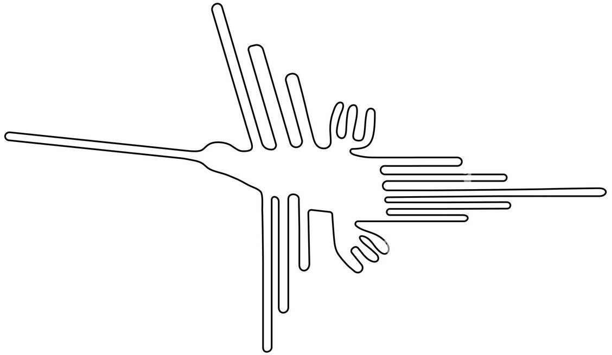
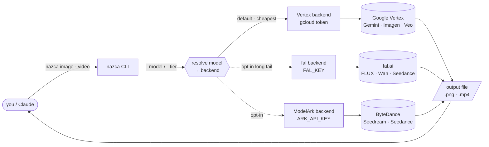
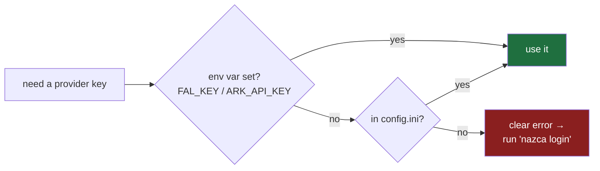
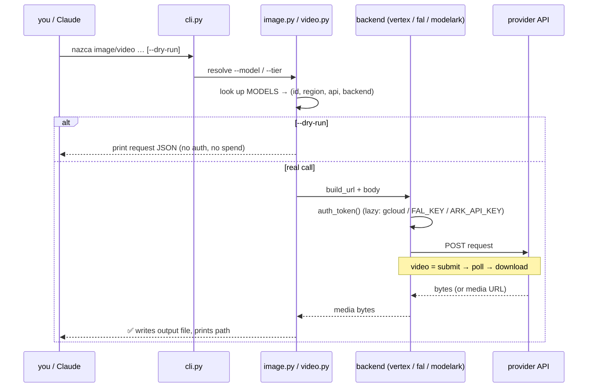

# nazca

<p align="center">
  
</p>

<p align="center"><em>the lines that draw themselves — image &amp; video, for agents</em></p>

A thin, **agent-driven CLI** for AI **image** and **video** generation. Two
commands, each does one thing and prints the output path. Claude (or you)
orchestrates — nazca is just clean, reliable access to the models.

> **Why "nazca"?** The [Nazca Lines](https://en.wikipedia.org/wiki/Nazca_Lines) are
> enormous figures — a hummingbird, a monkey, a spider — drawn into the Peruvian
> desert ~2,000 years ago. They're one of humanity's oldest acts of image-making at
> scale. This is the modern instrument for it: a prompt in, an image or video out.

**Direct-first, multi-provider:** Google Vertex AI is the default and the cheapest
path (no API key — `gcloud` handles auth). Opt into **fal.ai** for the long tail
(FLUX, Wan, Seedance) or **ByteDance ModelArk** with a single `nazca login`.

```bash
nazca image -o dish.png --ref photo.jpg -p "restyle: warm amber parrilla grade"
nazca video -o clip.mp4 -s start.png --end end.png -p "slow push-in, embers glow"
nazca video -o clip.mp4 -s start.png -p "..." --tier cheap   # pick the cheap model for you
```

## How it works



**Direct-first:** Google models always go straight to Vertex (cheapest, no key). fal and
ModelArk are dotted because they're opt-in — a Vertex-only run never touches their keys.

---

## Why this exists

We kept reaching for heavier options — a full content framework, an MCP server,
SaaS image tools — when what actually worked was: **the agent writes the prompt,
judges the result, and runs a small command.** That's `nazca`. It is the
"hands" (instruments). The "how" (brand rules, prompt recipes) belongs in an
[Agent Skill](https://www.anthropic.com/engineering/equipping-agents-for-the-real-world-with-agent-skills);
posting belongs in MCP. nazca stays deliberately small.

Design choices:
- **No API keys for Google models.** Vertex AI via `gcloud` — short-lived OAuth token minted per call, nothing persisted. Opt into a non-Google backend (e.g. fal) and you need that provider's key; keep it in your shell profile / secrets manager, never in a script or CLI flag.
- **Two tiny dependencies:** `click` + `Pillow`.
- **Stdlib HTTP** (`urllib`) — the whole thing is a few hundred lines.
- **`--dry-run`** on both commands prints the exact request before spending anything.

---

## Install

One command — installs the global `nazca` CLI straight from GitHub:

```bash
pipx install "git+https://github.com/MRCORD/nazca.git"
```

Then verify and authenticate (one-time):

```bash
nazca --help            # lists: image, video, login, config
gcloud auth login          # for the default Vertex path — no API key needed
```

That's it. `nazca image -o out.png -p "a test" --dry-run` prints the request without spending.

<details>
<summary><b>Prerequisites & options</b></summary>

- **Python ≥ 3.10** and the [Google Cloud SDK](https://cloud.google.com/sdk/docs/install) (`gcloud`) for the default Vertex path.
- **No `pipx`?** Install it once: `brew install pipx` (macOS) or `python3 -m pip install --user pipx`.
- **Private repo / no GitHub HTTPS auth?** Use SSH:
  ```bash
  pipx install "git+ssh://git@github.com/MRCORD/nazca.git"
  ```
- **Arrow-key login UI** (optional questionary extra):
  ```bash
  pipx install "nazca[tui] @ git+https://github.com/MRCORD/nazca.git"
  ```
- **`uv` user?** `uv tool install "git+https://github.com/MRCORD/nazca.git"` does the same.

</details>

<details>
<summary><b>Development (clone + editable install)</b></summary>

```bash
git clone https://github.com/MRCORD/nazca.git && cd nazca
python3 -m venv .venv && . .venv/bin/activate
pip install -e .            # core: click + Pillow
pip install -e ".[tui]"     # optional arrow-key login UI
```

</details>

## Quickstart

```bash
# 1. one-time auth for the default Google/Vertex path (no API key)
gcloud auth login

# 2. confirm your setup — prints the request, spends nothing
nazca image -o test.png -p "a rustic Peruvian parrilla scene, 9:16" --dry-run

# 3. make a real image
nazca image -o dish.png -p "grilled anticuchos, warm amber parrilla light, 9:16"

# 4. animate that image into a clip (cheap 720p tier)
nazca video -o dish.mp4 -s dish.png -p "slow cinematic push-in, embers glow" --tier cheap
```

**The golden rule:** every command takes `--dry-run` — it prints the exact request and
**spends nothing**. Use it to verify before any real call.

| I want to… | command |
|---|---|
| see all commands | `nazca --help` |
| see a command's flags | `nazca image --help` |
| preview without spending | add `--dry-run` |
| let it pick the cheap model | add `--tier cheap` |
| restyle a real photo | `nazca image -o out.png --ref photo.jpg -p "..."` |
| store a fal/ModelArk key | `nazca login` |

> nazca makes **clean media only** (no baked-in text/logos — overlays go in Figma).
> Google/Vertex models (the defaults) are the proven path; fal/ModelArk are dry-run-tested only.

---

## Setup / credentials

`nazca login` (or `nazca config set`) stores API keys in a local config file so you don't need to set env vars on every shell.

```bash
nazca login                         # interactive provider menu — hides input, masks confirmation
nazca config set fal_key sk-...    # set one key non-interactively
nazca config get fal_key            # show masked value + source (env / file / unset)
nazca config list                   # all known keys, masked, with sources
nazca config path                   # print the config file location
```

### `nazca login` — interactive credential setup

`nazca login` shows a looping provider menu so you can set multiple keys in one session.
Pick a provider, paste the key (hidden), confirm with the masked preview, then choose **Done**.

```
1. fal.ai  (FAL_KEY)
2. ByteDance ModelArk  (ARK_API_KEY)
3. Vertex AI  (gcloud — no key needed)
4. Done
```

The key is never echoed; the confirmation line shows only a masked value like `sk...d999`.

**Arrow-key UI (optional):** install the `tui` extra for a nicer arrow-key + hidden-paste experience:

```bash
pip install "nazca[tui]"   # adds questionary>=2.0
```

Without `questionary`, or when stdin is not a TTY (piped/scripted), `nazca login`
automatically falls back to the numbered menu above — same behavior, no missing features.

Keys are written to `~/.config/nazca/config.ini` (or `$XDG_CONFIG_HOME/nazca/config.ini`).
The config directory is created with mode `0700` and the file is chmod'd to `0600` after every write.

**Precedence**: env var > config file > unset.
Setting `FAL_KEY` in your shell overrides whatever is in the file.



**Vertex needs no key** — `gcloud` handles auth transparently (it never enters this flow).

---

## Auth

### Google models (default — no API key)

Everything Vertex runs through your gcloud credentials. No keys, nothing persisted.

```bash
gcloud auth login
```

Defaults target project `florece-492623`, region `us-central1`. Override via env:

| env var | default | purpose |
|---|---|---|
| `VERTEX_PROJECT` | `florece-492623` | GCP project (billing/credits) |
| `VERTEX_LOCATION` | `us-central1` | default region (some models are `global`) |
| `VEO_MODEL` | `veo-3.1-fast-generate-001` | default video model |
| `VEO_POLL_INTERVAL` / `VEO_POLL_MAX_TRIES` | `15` / `60` | video/fal polling |

### fal.ai (opt-in — long-tail models only)

Models like FLUX schnell/dev, Seedance, and Wan have no Google first-party path;
fal.ai gives them all under one key. Google models **stay on Vertex** (direct is cheaper).

```bash
export FAL_KEY=<your-key>   # fal.ai dashboard → API keys
```

Keep `FAL_KEY` in your shell profile or a secrets manager (`~/.zshrc`,
`~/.profile`, 1Password, etc.). **Never** pass it as a CLI flag (shell history)
or commit it to a file. A Vertex-only run never reads `FAL_KEY`.

| `--model` | fal model id | notes |
|---|---|---|
| `flux-schnell` | fal-ai/flux/schnell | fastest FLUX; ~$0.003/MP |
| `flux-2-dev` | fal-ai/flux/dev | FLUX 2 dev; higher quality |
| `seedance-2-fast` | fal-ai/bytedance/seedance/v2/lite | video; tier/resolution-dependent pricing |
| `wan-2.6` | fal-ai/wan/v2.6/text-to-video | video; ~$0.05/s |

> **Note:** fal model IDs and pricing are subject to change — verify against
> [fal.ai/models](https://fal.ai/models) before spending. Use `--dry-run` first.

### ByteDance ModelArk (opt-in, optional cost path — NOT default)

An alternative direct path to ByteDance's Seedream (image) and Seedance (video) models.
**This is an optional cost path, not a default.** Vertex and fal behavior is entirely unchanged.

> **CAUTION: ModelArk API IDs, endpoints, and schemas are UNVERIFIED. Use `--dry-run` only until you
> have benchmarked ModelArk direct against `seedance-2-fast` via fal at your real resolution/tier.
> The "~25% cheaper" claim is unverified — do not assume cost savings before measuring.**

```bash
export ARK_API_KEY=<your-key>   # ByteDance ModelArk → API keys (ark.bytepluses.com)
```

Keep `ARK_API_KEY` in your shell profile or a secrets manager. **Never** pass it as a CLI flag
or commit it to a file. A Vertex-only or fal-only run never reads `ARK_API_KEY`.

| `--model` | ModelArk model id | type | notes |
|---|---|---|---|
| `seedream` | seedream-4-0 | image | text-to-image; ID UNVERIFIED |
| `seedance-pro` | seedance-3-pro | video | async task; ID UNVERIFIED |
| `seedance-lite` | seedance-3-lite | video | async task; ID UNVERIFIED |

**Known caveats (verify against current ModelArk docs before spending):**
- **720p cap** on video output — upscale in post if 1080p is required.
- **Close-up-face privacy flag** — close-up face frames may be refused by the API.
- **Billing-dashboard lag** — ModelArk billing may not reflect charges in real time.
- **~25% cheaper claim is UNVERIFIED** — Seedance pricing is tier/resolution-dependent
  (Fast ~$0.022/s vs Pro ~$0.247/s observed); measure at your target resolution before
  switching from fal.
- **Endpoints and model IDs are UNVERIFIED** — use `--dry-run` only until confirmed against
  official [ModelArk docs](https://ark.bytepluses.com).

---

## `nazca image`

Generate an image, or **restyle a real photo** with `--ref` (image-to-image —
the brand-accurate path: keep the real dish, change the look).

```bash
# restyle a real product photo (recommended)
nazca image -o out.png --ref dish.jpg -p "warm amber/ochre grade, side-back key, honey-stained wood"

# multiple references (gemini-3-pro-image accepts up to 14 — dish + style refs)
nazca image -o out.png --model nano-banana-pro --ref dish.jpg --ref style.jpg -p "..."

# fresh text-to-image (no source) via Imagen
nazca image -o out.png --model imagen-4 -p "a rustic Peruvian parrilla scene, 9:16"

# inspect the request without calling the API
nazca image -o out.png --ref dish.jpg -p "..." --dry-run
```

| `--model` | id | region | `--ref`? | notes |
|---|---|---|---|---|
| `nano-banana` *(default)* | gemini-2.5-flash-image | us-central1 | ✅ | fast, cheap |
| `nano-banana-3` | gemini-3.1-flash-image | global | ✅ | newer flash (GA) |
| `nano-banana-pro` | gemini-3-pro-image | global | ✅ (≤14) | highest fidelity |
| `imagen-4` / `imagen-4-fast` / `imagen-3` | imagen-4.0-* / 3.0 | us-central1 | ❌ | text-to-image only |

Options: `-o/--out`, `-p/--prompt`, `--ref` (repeatable), `--model`, `--aspect`
(default `9:16`), `--dry-run`. Full availability: [`docs/vertex-models.md`](docs/vertex-models.md).

---

## `nazca video`

Vertex **Veo 3.1** image-to-video (ported from a battle-tested script). Start
frame + **optional end frame** (keyframe interpolation). Submit → poll → download.

```bash
# single start frame + motion (best for camera moves: push-in, pull-back)
nazca video -o clip.mp4 -s start.png -p "slow cinematic push-in, embers glow"

# 720p Lite model — ~2x cheaper, perfect for mobile/social
nazca video -o clip.mp4 -s start.png -p "..." --model veo-3.1-lite

# start + end frame (keyframe — only when the two frames are tight variants)
nazca video -o clip.mp4 -s a.png --end b.png -p "the skewer lifts off the grill"

nazca video -o clip.mp4 -s start.png -p "..." --dry-run   # request JSON, no credits
```

| `--model` | resolution | $/sec (720p) | notes |
|---|---|---|---|
| `veo-3.1-lite` | 720p | $0.05 | ~2x cheaper, mobile/social |
| `veo-3.1-fast` *(default)* | 720p | $0.10 | smooth interpolation |
| `veo-3.1` | 720p/1080p | $0.20 | highest quality (video-only) |

Prices are official Google Cloud rates (verified 2026-06-18). `--audio` costs extra
— the full `veo-3.1` is $0.40/s with audio (2x its silent rate); clips are silent by
default, so this only applies if you pass `--audio`.

Options: `-o/--out`, `-s/--start`, `-p/--prompt`, `--end`, `--model`
(default `veo-3.1-fast`), `--duration` (4/6/8), `--aspect`
(`9:16`/`16:9`), `--resolution` (`720p`/`1080p`), `--audio`, `--dry-run`.

Notes: clips are **silent by default** (add audio in post). Keyframe interpolation
**morphs** if the end frame isn't a tight variant of the start — use single-frame
for camera moves.

---

## Cost tiers (`--tier cheap|premium`)

Instead of memorizing model ids, pass `--tier cheap` or `--tier premium`. The flag
is ignored when `--model` is given (explicit model always wins).

```bash
nazca video -o clip.mp4 -s start.png -p "push-in" --tier cheap    # → veo-3.1-lite
nazca video -o clip.mp4 -s start.png -p "push-in" --tier premium  # → veo-3.1
nazca image -o out.png -p "dish restyle" --tier cheap              # → nano-banana
nazca image -o out.png -p "dish restyle" --tier premium            # → nano-banana-pro
```

Tier defaults are **Vertex-direct** (direct-first rule — Google models never routed through fal).

| command | `--tier cheap` | `--tier premium` | notes |
|---|---|---|---|
| `image` | `nano-banana` ~$0.039/img | `nano-banana-pro` ~$0.134/img @2K | pro: legible text, up to 14 refs |
| `video` | `veo-3.1-lite` $0.05/s (720p) | `veo-3.1` $0.20/s (720p) | lite: 2x cheaper than the default fast tier, great for mobile/social |

Other models and rough prices (official Google Cloud, verified 2026-06-18):

| model | $/unit | tier |
|---|---|---|
| `imagen-4-fast` | $0.02/img | cheap |
| `nano-banana` (gemini-2.5-flash-image) | ~$0.039/img | cheap |
| `imagen-4` | $0.04/img | premium |
| `nano-banana-pro` (gemini-3-pro-image) | ~$0.134/img @2K | premium |
| `veo-3.1-lite` | $0.05/s | cheap |
| `veo-3.1-fast` | $0.10/s (720p) / $0.12/s (1080p) | cheap |
| `veo-3.1` | $0.20/s video-only; $0.40/s with audio | premium |
| fal/FLUX schnell | ~$0.003/MP | cheap |
| Seedance (via fal) | tier/resolution-dependent — verify per call | — |

> Audio doubles Veo 3.1's rate ($0.20 → $0.40/s). Seedance pricing varies by
> tier and resolution — do not assume a single $/s figure.

---

## Workflow rule (locked)

- **nazca produces CLEAN media only** — food/product restyles + video, no
  baked-in text. Prompt for clean images and keep the bottom third calm/darker.
- **All text + brand overlays are done in Figma** (master templates + real
  wordmark). Do *not* prompt the image model to render captions/headlines/logos —
  even though `gemini-3-pro-image` *can* render legible text, we don't use it for that.

---

## Architecture

```
src/nazca/
├── cli.py                  click entrypoint: `image`, `video`
├── backends/
│   ├── __init__.py         BACKENDS registry + get_backend()
│   ├── base.py             Backend interface (auth_token, build_url, post, encode)
│   ├── vertex.py           Vertex AI: gcloud OAuth token + REST
│   ├── fal.py              fal.ai: FAL_KEY + queue submit→poll→download
│   └── modelark.py         ByteDance ModelArk: ARK_API_KEY + REST (UNVERIFIED — dry-run only)
├── vertex.py               back-compat shim (re-exports from backends/vertex.py)
├── image.py                Gemini/Imagen (Vertex), FLUX (fal), Seedream (ModelArk) dispatch
├── video.py                Veo (Vertex), Seedance/Wan (fal), Seedance (ModelArk) dispatch
└── config.py               env-overridable defaults (incl. FAL_KEY, ARK_API_KEY, optional)
docs/vertex-models.md       functionally-probed Vertex model inventory
```

Routing is **data, not code**: a `backend` field in the `MODELS` map selects the
provider. Adding a model is a one-line entry; adding a provider is a new `Backend`
subclass + one key in `BACKENDS`. Auth is lazy — a Vertex-only run never reads
`FAL_KEY` or `ARK_API_KEY`.

### Request flow



---

## Limitations / not in scope

- No overlay/captioning (Figma does that), no posting (MCP/Postiz does that), no
  brand config or autopilot (a Skill does that).
- `image` covers Gemini + Imagen; no Imagen *edit* model wired yet
  (`imagen-3.0-capability-001` would add Imagen ref-edits).
- `video` is synchronous (polls inline). Full `veo-3.1-generate-001` is available
  but only the fast model is heavily exercised.
- Model IDs change often — re-probe with the recipe in `docs/vertex-models.md`.

## License

Private / internal tooling.
