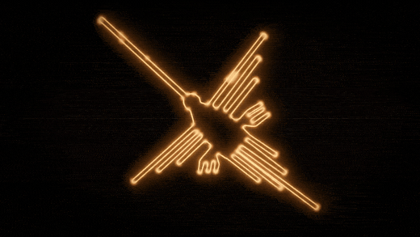
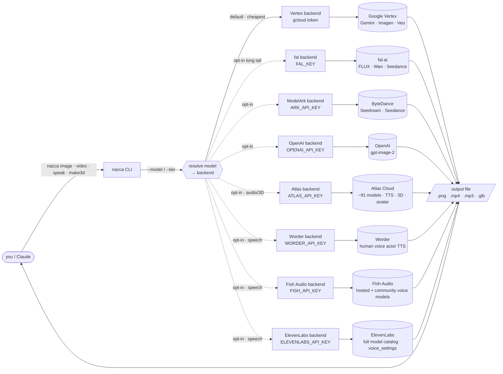
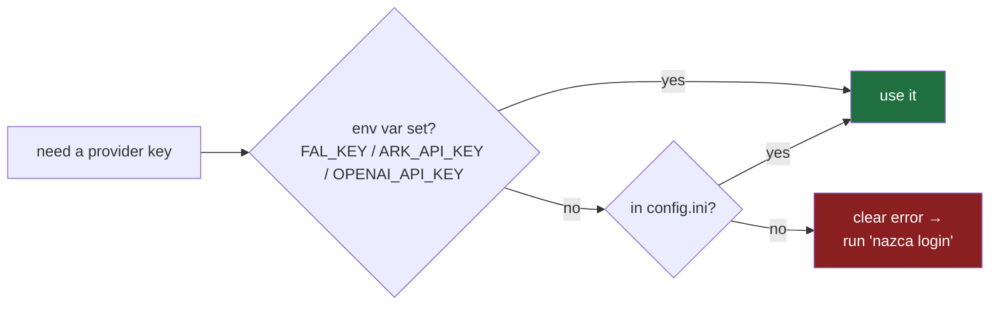
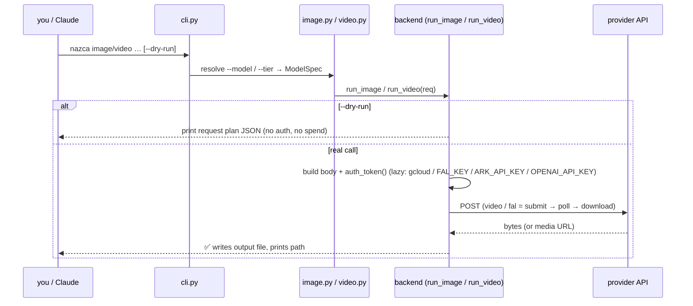

# nazca

<p align="center">
  
</p>

<p align="center"><em>the lines that draw themselves — image, video, speech &amp; 3D generation, for agents</em></p>

**nazca** is a thin, **agent-driven CLI** for AI **image**, **video**, **speech**, and **3D** generation.
Each command does one thing and prints the output path. Claude (or you) writes
the prompt and judges the result — nazca is just clean, reliable access to the models.

```bash
nazca image -o dish.png --ref photo.jpg -p "restyle: warm amber parrilla grade"
nazca video -o clip.mp4 -s start.png -p "slow push-in, embers glow" --tier cheap
nazca speak "Fresh off the grill, every night." -o vo.mp3
nazca make3d "a stylised anticucho skewer" -o skewer.glb
```

> **Why "nazca"?** The [Nazca Lines](https://en.wikipedia.org/wiki/Nazca_Lines) are enormous figures —
> a hummingbird, a monkey, a spider — drawn into the Peruvian desert ~2,000 years ago: one of humanity's
> oldest acts of image-making at scale. This is the modern instrument for it: a prompt in, an image or video out.

---

## Contents

- [How it works](#how-it-works)
- [Install](#install)
- [Quickstart](#quickstart)
- [Commands](#commands) — [`image`](#nazca-image) · [`video`](#nazca-video) · [`speak`](#nazca-speak) · [`voice-clone` & `voice-design`](#nazca-voice-clone-and-nazca-voice-design) · [`music`](#nazca-music) · [`sfx`](#nazca-sfx) · [`make3d`](#nazca-make3d) · [`grade` & `format`](#nazca-grade-and-nazca-format) · [`batch`](#nazca-batch)
- [Models & cost](#models--cost) — the `--tier` shortcut + price table
- [Diagnostics](#diagnostics--v---vv) — `-v`/`-vv` logging + `NAZCA_LOG_LEVEL`
- [Credentials](#credentials) — `nazca login`, precedence, per-provider setup
- [Custom / overriding models](#custom--overriding-models)
- [Use with Claude Desktop (MCP)](#use-with-claude-desktop-mcp)
- [Design & architecture](#design--architecture)
- [Limitations](#limitations)

---

## How it works

One prompt → nazca picks a model → routes to the right provider backend → writes a file.


```mermaid
flowchart LR
    A([you / Claude]) -->|"nazca image · video · speak · make3d"| CLI[nazca CLI]
    CLI -->|"--model / --tier"| R{{resolve model<br/>→ backend}}
    R -->|default · cheapest| V[Vertex backend<br/>gcloud token]
    R -.->|opt-in long tail| F[fal backend<br/>FAL_KEY]
    R -.->|opt-in| M[ModelArk backend<br/>ARK_API_KEY]
    R -.->|opt-in| OA[OpenAI backend<br/>OPENAI_API_KEY]
    R -.->|opt-in · audio/3D| AT[Atlas backend<br/>ATLAS_API_KEY]
    R -.->|opt-in · speech| WD[Worder backend<br/>WORDER_API_KEY]
    R -.->|opt-in · speech| FI[Fish Audio backend<br/>FISH_API_KEY]
    R -.->|opt-in · speech| EL[ElevenLabs backend<br/>ELEVENLABS_API_KEY]
    V --> G[(Google Vertex<br/>Gemini · Imagen · Veo)]
    F --> FP[(fal.ai<br/>FLUX · Wan · Seedance)]
    M --> MP[(ByteDance<br/>Seedream · Seedance)]
    OA --> OP[(OpenAI<br/>gpt-image-2)]
    AT --> ATP[(Atlas Cloud<br/>~91 models · TTS · 3D · avatar)]
    WD --> WDP[(Worder<br/>human voice actor TTS)]
    FI --> FIP[(Fish Audio<br/>hosted + community voice models)]
    EL --> ELP[(ElevenLabs<br/>full model catalog · voice_settings)]
    G & FP & MP & OP & ATP & WDP & FIP & ELP --> O[/output file<br/>.png · .mp4 · .mp3 · .glb/]
    O --> A
```

**Direct-first.** Google models always go straight to Vertex — the cheapest path, no API key. fal,
ModelArk, OpenAI, Atlas Cloud, Worder, Fish Audio, and ElevenLabs are *dotted* because they're opt-in: a
Vertex-only run never reaches for their keys. **Atlas Cloud** is one async API fronting ~91 models and is
the home of the **speech (TTS)**, **3D (GLB)**, and **avatar / lip-sync** modalities. **Worder**, **Fish
Audio**, and **ElevenLabs** are three further, alternative speech providers — Worder a marketplace of
real, ethically-sourced human voice actors instead of a house TTS model; Fish Audio a platform of hosted +
community voice models selected by `reference_id`; ElevenLabs a direct path to its own model catalog
(`eleven_multilingual_v2` by default), previously only reachable indirectly via one fixed Atlas-proxied
model.

---

## Install

**Two ways to use nazca — pick the one that matches how you'll run it:**

| You want to use it from… | Install | Section |
|---|---|---|
| **Terminal / Claude Code** | the `nazca` CLI (below) | this section |
| **Claude Desktop app** | the MCP server | [Use with Claude Desktop](#use-with-claude-desktop-mcp) |
| **Your own Python code** | `import nazca` | [Python library](#python-library) |

> **How it's distributed:** nazca is published to **PyPI** under the project name **`nazca-cli`**
> (the plain `nazca` name was already taken by an unrelated package) — the `nazca` command and the
> importable `nazca` module are unaffected, only the PyPI listing name differs.

### CLI (terminal)

```bash
uv tool install nazca-cli      # recommended — installs `nazca` + `nazca-mcp`
# or:  pipx install nazca-cli
# or:  pip install nazca-cli
```

Then authenticate the default (Google) path — no API key needed:

```bash
gcloud auth login
nazca --help    # image · video · login · config · models · setup
```

<details>
<summary><b>Prerequisites & options</b></summary>

- **Python ≥ 3.10** + the [Google Cloud SDK](https://cloud.google.com/sdk/docs/install) (`gcloud`) for the Vertex path.
- **No `uv`?** `brew install uv` (macOS) — or use `pipx` (`brew install pipx`).
- **Zero-install, always-latest** (like `npx`): `uvx --from nazca-cli nazca --help` runs the newest
  published version with nothing left behind — no upgrade step, ever.
- **Arrow-key login UI** (optional): add the `tui` extra → `uv tool install "nazca-cli[tui]"`.
- **Update later:** `uv tool upgrade nazca-cli` (or `pipx upgrade nazca-cli`) — unlike a git-tag pin,
  this always moves you to the newest PyPI release.
- **Track an unreleased commit instead of PyPI:** `uv tool install "git+https://github.com/Mysios-Labs-inc/nazca.git"`
  (optionally `@<branch-or-tag>`) installs straight from the repo.

</details>

<details>
<summary><b>Development (clone + editable install)</b></summary>

```bash
git clone https://github.com/Mysios-Labs-inc/nazca.git && cd nazca
python3 -m venv .venv && . .venv/bin/activate
pip install -e ".[tui]"     # core (click + Pillow) + optional arrow-key UI
```

</details>

---

## Quickstart

```bash
gcloud auth login                                                    # 1. one-time auth (Vertex, no key)
nazca image -o test.png -p "a rustic Peruvian parrilla scene" --dry-run   # 2. preview — spends nothing
nazca image -o dish.png -p "grilled anticuchos, warm amber light, 9:16"   # 3. make a real image
nazca video -o dish.mp4 -s dish.png -p "slow push-in, embers glow" --tier cheap   # 4. animate it
```

> **The golden rule:** every command takes **`--dry-run`** — it prints the exact request and **spends
> nothing**. Use it to confirm your setup before any real call.

| I want to… | do this |
|---|---|
| see all commands | `nazca --help` |
| see a command's flags | `nazca image --help` |
| preview without spending | add `--dry-run` |
| let nazca pick the cheap model | add `--tier cheap` |
| restyle a real photo | `nazca image -o out.png --ref photo.jpg -p "..."` |
| store a fal / ModelArk key | `nazca login` |
| list available models | `nazca models` |

nazca makes **clean media only** — no baked-in text/logos (overlays belong in Figma). Google/Vertex
models (the defaults) are proven live; fal is dry-run-tested; ModelArk needs [console activation](#bytedance-modelark-opt-in).

---

## Python library

Beyond the CLI, nazca exposes a small typed API for use inside your own scripts, agents, or services:

```python
from nazca import generate_image, generate_video, modify_image, ModelSpec, BackendError

# Generate — returns the written Path; pass dry_run=True to get the request plan dict instead.
out = generate_image("dish.png", "grilled anticuchos, warm amber light", aspect_ratio="9:16")

# Restyle from references, pick a model, preview without spending:
plan = generate_image("out.png", "...", ref=["photo.jpg"], model="nano-banana-pro", dry_run=True)

# Animate a still (start frame, prompt; pick a model by name):
generate_video("dish.mp4", "dish.png", "slow push-in, embers glow", model="veo-3.1-fast")

try:
    generate_image("o.png", "...", model="flux-schnell")   # opt-in backend (needs FAL_KEY)
except BackendError as e:
    ...  # every provider failure subclasses BackendError; rate limits are RateLimitError
```

Credentials resolve the same way as the CLI (env var → `~/.config/nazca/config.ini`) and are read
**lazily** — importing nazca or running a dry-run never touches a key. `ModelSpec` (from `nazca.models`)
is the typed record for every built-in model. (The `--tier cheap|premium` convenience is CLI-only; from
Python, pass `model=` explicitly.)

---

## Commands

### `nazca image`

Generate an image, **restyle a real photo** with `--ref` (image-to-image — keep the real subject,
change the look), or **modify** an existing image (a positional `SOURCE` + one op flag).

```bash
# restyle a real product photo (recommended)
nazca image -o out.png --ref dish.jpg -p "warm amber/ochre grade, side-back key, honey-stained wood"

# multiple references (nano-banana-pro takes up to 14 — subject + style refs)
nazca image -o out.png --model nano-banana-pro --ref dish.jpg --ref style.jpg -p "..."

# fresh text-to-image via Imagen
nazca image -o out.png --model imagen-4 -p "a rustic Peruvian parrilla scene, 9:16"

# legible text / ad creative via OpenAI gpt-image-2 (needs OPENAI_API_KEY)
nazca image -o ad.png --model gpt-image-2 --quality medium -p "Poster headline: GRAND OPENING — 50% OFF"

# modify an existing image (SOURCE + one op flag — no prompt for upscale/rmbg)
nazca image dish.png -o big.png   --upscale --scale 4        # super-resolution (fal)
nazca image dish.png -o cut.png   --rmbg                     # background removal → transparent PNG (fal)
nazca image dish.png -o fix.png   --mask m.png -p "..."      # inpaint the white-masked region
nazca image dish.png -o wide.png  --outpaint --expand 320    # extend the canvas (fal)
nazca image dish.png -o styled.png --style --ref look.png -p "..."  # style transfer (Atlas)
```

| `--model` | id | region | `--ref`? |
|---|---|---|---|
| `nano-banana` *(default)* | gemini-2.5-flash-image | us-central1 | ✅ |
| `nano-banana-2` | gemini-3.1-flash-image | global | ✅ |
| `nano-banana-2-lite` | gemini-3.1-flash-lite-image | global | ✅ (1 ref) |
| `nano-banana-pro` | gemini-3-pro-image | global | ✅ (≤14) |
| `imagen-4` · `imagen-4-fast` · `imagen-3` | imagen-4.0-\* / 3.0 | us-central1 | ❌ (text-to-image only) |
| `gpt-image-2` | gpt-image-2 (OpenAI) | — | ✅ (≤5, via `/images/edits`) |

`gpt-image-2` leads on **legible text + ad creative**. Caveats: needs `OPENAI_API_KEY`, billed per
**token** (no flat $/image — output tokens scale with size×quality), and noticeably slower than the
Gemini/fal paths (~30–105s depending on `--quality`). Use `--quality` to trade cost/speed for fidelity.

**Flags:** `-o/--out` · `-p/--prompt` · `--ref` (repeatable) · `--model` · `--aspect` (default `9:16`) ·
`--size 1K\|2K\|4K` (gemini-3 only) · `--quality low\|medium\|high\|auto` (gpt-image-2 only; default
`high`) · `--tier cheap\|premium` · `--dry-run`.
**Modify ops** (each takes a positional `SOURCE`, pick one): `--upscale --scale 1-4` · `--rmbg` ·
`--mask <png> -p` (inpaint) · `--outpaint --expand <px>` · `--style --ref <png> -p`.
Full Vertex inventory: [`docs/vertex-models.md`](docs/vertex-models.md).

### `nazca video`

Vertex **Veo 3.1** image-to-video. Start frame **+ optional end frame** (keyframe interpolation).
Submit → poll → download.

```bash
# single start frame + motion (best for camera moves)
nazca video -o clip.mp4 -s start.png -p "slow cinematic push-in, embers glow"

# cheapest 720p (veo-3.1-lite)
nazca video -o clip.mp4 -s start.png -p "..." --tier cheap

# start + end frame (keyframe — only when they're tight variants of each other)
nazca video -o clip.mp4 -s a.png --end b.png -p "the skewer lifts off the grill"

# text-to-video (no start frame)
nazca video -o clip.mp4 -p "drone sweep over a smoky parrilla at dusk" --model atlas-seedance-2

# lip-sync talking head: portrait + driving audio (Atlas avatar)
nazca video -o vo.mp4 -s host.png --avatar --audio-in vo.mp3

# Gemini Omni Flash: t2v/i2v, fixed ~10s/720p+audio, resolves synchronously (no poll)
nazca video -o clip.mp4 -p "a marble rolling down a wooden ramp" --model omni-flash

# Omni Flash ref2v: combine subject/style reference images (no --start needed)
nazca video -o clip.mp4 -p "a cat batting at a ball of yarn" --model omni-flash --ref2v --ref cat.png --ref yarn.png

# Omni Flash v2v: edit a LOCAL video file (not a URL — opposite of fal's --v2v)
nazca video clip.mp4 -o edited.mp4 -p "make it night time, add stars" --model omni-flash --v2v
```

**Flags:** `-o/--out` · `-s/--start` · `-p/--prompt` · `--end` · `--model` (default `veo-3.1-fast`) ·
`--duration 4\|6\|8` · `--aspect 9:16\|16:9` · `--resolution 720p\|1080p` · `--audio` · `--tier` · `--dry-run`.
`omni-flash` ignores `--duration`/`--resolution`/`--audio`/`--aspect` (fixed ~10s/720p+audio, landscape only)
and supports t2v/i2v/`--ref2v` (multi-image reference, `--ref` repeatable) /`--v2v` (no `--end`/keyframe).
Unlike fal's `--v2v`, omni-flash's `--v2v` SOURCE must be a **local file**, sent inline — not a URL.

**Atlas video ops** (opt-in, one at a time): `--avatar --audio-in <file>` (lip-sync) · `--ref2v --ref `
(reference-to-video) · `--effects --start ` · `--motion-control <SOURCE url>` · `--video-upscale <SOURCE url>` ·
`--reframe <SOURCE url>` (fal) · `--v2v <SOURCE url> -p` (fal) · `--extend <SOURCE url> -p` (fal).

> Clips are **silent by default** (`--audio` adds sound and **doubles** Veo's cost). Keyframe interpolation
> **morphs** if the end frame isn't a tight variant of the start — use a single frame for camera moves.

---

### `nazca speak`

Text-to-speech, via **Atlas Cloud** (needs `ATLAS_API_KEY`), **Worder** (needs `WORDER_API_KEY`),
**Fish Audio** (needs `FISH_API_KEY`), or **ElevenLabs** (needs `ELEVENLABS_API_KEY`). Takes the text
as a positional argument, writes an `.mp3` or `.wav`.

```bash
nazca speak "Fresh off the grill, every night." -o vo.mp3
nazca speak "..." -o vo.wav --format wav --model atlas-tts-elevenlabs-v3 --voice rachel

# Worder — TTS from real, ethically-sourced human voice actors (marketplace pricing)
nazca speak "[happy] Fresh off the grill, every night." -o vo.mp3 --model worder-tts --voice <voice_id>

# Fish Audio — hosted + community voice models, selected by reference_id
nazca speak "Fresh off the grill, every night." -o vo.mp3 --model fish-tts --voice <reference_id>

# ElevenLabs — direct access to ElevenLabs' own model catalog, selected by voice_id
nazca speak "Fresh off the grill, every night." -o vo.mp3 --model elevenlabs-tts --voice <voice_id>
```

**Flags:** `-o/--out` (`.mp3`/`.wav`) · `--model` (default `atlas-tts-grok`; also `atlas-tts-elevenlabs-v3`,
`worder-tts`, `fish-tts`, `elevenlabs-tts`) · `--voice <name>` (model-specific; **required** for
`worder-tts` — a `voice_id` from `GET https://worder.com/api/v1/voices` — `fish-tts` — a `reference_id`
from `GET https://api.fish.audio/model` — and `elevenlabs-tts` — a `voice_id` from
`GET https://api.elevenlabs.io/v2/voices`) · `--format mp3\|wav` · `--tier cheap\|premium` · `--dry-run`.

> **Worder** is a TTS marketplace of verified human voice actors, not a house model — there's no
> default voice, pricing is per-second and set per actor (from $0.01/s, so `nazca` can't estimate
> `--dry-run` cost for it), and text supports direction tags (`[happy]`), pause tags (`[pause N]`),
> emphasis tags, and pronunciation overrides (`{written|spoken}`). A synthesis that fails Worder's
> Whisper-transcript quality check (<90% similarity) returns HTTP 422 and is **not charged**.

> **Fish Audio** is a TTS platform of hosted + community voice models, also with no single default
> voice — pick one via `--voice <reference_id>` (from `GET https://api.fish.audio/model`). The
> synthesis quality tier (`s1`, `s2-pro`, `s2.1-pro`, `s2.1-pro-free`) is a separate `model` HTTP
> header nazca defaults to `s2-pro`; pricing is unverified against a live key, so `--dry-run` shows
> the request plan, not a cost estimate.

> **ElevenLabs** is nazca's fourth speech provider — a direct path to ElevenLabs' own model catalog,
> instead of the one fixed model Atlas proxies (`atlas-tts-elevenlabs-v3`). No default voice — pick
> one via `--voice <voice_id>` (from `GET https://api.elevenlabs.io/v2/voices`). Auth is `xi-api-key`,
> **not** `Authorization: Bearer` like every other backend here. The TTS model defaults to
> `eleven_multilingual_v2` (ElevenLabs' own default) — not user-configurable today. `voice_settings`
> (stability/similarity/style/speed) is also not exposed via CLI yet — ElevenLabs' own defaults apply.
> This pass is **TTS only**; sound effects, voice design, speech-to-speech, dubbing, etc. are a later
> follow-up (see `docs/media-modalities.md`'s Audio roadmap, A3). Pricing is subscription-tier-based,
> so `--dry-run` shows the request plan, not a cost estimate.

### `nazca voice-clone` and `nazca voice-design`

Two voice-creation commands — distinct from `nazca speak` because neither produces a single
TTS output file: `voice-clone` derives a reusable voice from audio samples (returns a voice
id, no media file), and `voice-design` generates several candidate voices from a text
description (returns N preview clips). `voice-clone` is available on two backends: Fish Audio
(needs `FISH_API_KEY`, the default) and, since issue #122 phase A3, ElevenLabs (needs
`ELEVENLABS_API_KEY`, via `--model elevenlabs-voice-clone`); `voice-design` is Fish Audio only.

```bash
# Clone a reusable voice from one or more samples (Fish Audio, the default)
nazca voice-clone sample1.mp3 sample2.mp3 --title "My Voice"
# ✅ Voice cloned: <reference_id>
#    ↳ use it: nazca speak "..." -o out.mp3 --model fish-tts --voice <reference_id>

# Same, on ElevenLabs instead
nazca voice-clone sample1.mp3 sample2.mp3 --title "My Voice" --model elevenlabs-voice-clone
#    ↳ use it: nazca speak "..." -o out.mp3 --model elevenlabs-tts --voice <voice_id>

# Generate candidate voices from a text description
nazca voice-design "Warm, confident studio narrator" -o narrator
# writes narrator_0.mp3, narrator_1.mp3 (default n=2)
```

**`nazca voice-clone` flags:** one or more positional audio sample paths (required) ·
`--title` (required) · `--description` · `--visibility private\|unlist\|public` (default
`private` — Fish's own API default is `public`; nazca defaults to the safer choice;
ElevenLabs has no visibility concept, so this flag is accepted-but-ignored on that backend) ·
`--tags a,b` (Fish only — also accepted-but-ignored on ElevenLabs) · `--model` (default
`fish-voice-clone`; pass `elevenlabs-voice-clone` for ElevenLabs) · `--dry-run` (prints the
request plan to stdout — file sizes/names only, never the raw audio bytes). Fish caps at 20
samples/call; ElevenLabs documents no per-call cap, only a workspace-wide 500-total-voices
limit nazca can't check client-side.

**`nazca voice-design` flags:** positional text INSTRUCTION (required) · `-o/--out` — an
**output filename prefix**, not a full path (default `voice_design`; writes
`<prefix>_<index>.mp3` per candidate) · `--reference-text` (preview text, ≤150 chars) ·
`--language` (BCP-47, e.g. `en`) · `-n` (candidate count, 1-4, default 2) · `--speed`
(default 1.0) · `--model` (default `fish-voice-design`) · `--dry-run` (writes
`<prefix>.request.json`, same sidecar convention as `speak`/`make3d`).

> Both commands are unpriced (`--dry-run` shows the request plan, not a cost estimate) —
> Fish Audio pricing is unverified against a live key (same posture as `fish-tts`), and
> ElevenLabs pricing is subscription-tier-based (same posture as `elevenlabs-tts`).

### `nazca music`

Generate a song from a style prompt via Atlas Cloud (needs `ATLAS_API_KEY`) — `music`,
distinct from `speak`'s text-to-*speech*, is nazca's first text-to-*music* op.

```bash
nazca music "warm acoustic folk, gentle guitar" -o track.mp3
nazca music "upbeat synth-pop" --lyrics "[Verse]
Walking through the city lights" -o track.mp3
```

**Flags:** positional style PROMPT (required) · `-o/--out` (`.mp3`/`.wav`, required) ·
`--lyrics` (optional `[Verse]`/`[Chorus]`-structured text) · `--format mp3|wav` ·
`--model` (default `atlas-music-minimax`, the only music model wired today —
`minimax/music-2.6`, $0.15/gen) · `--dry-run`.

> **Status:** request/response schema is confirmed — Atlas's live model-list API links
> each model to its own public OpenAPI fragment (`prompt`/`lyrics`/`format`/
> `is_instrumental`/`sample_rate`/`bitrate`; nazca wires the first three). The $0.15/gen
> price is likewise confirmed from that same API, unlike most other Atlas entries in this
> README, which are priced from marketing copy — but it's still untested against a live
> generation, so `--dry-run` first.

### `nazca sfx`

```bash
nazca sfx "glass breaking on concrete" -o effect.mp3
nazca sfx "heavy rainfall with distant thunder" --duration 8 -o rain.mp3
```

**Flags:** positional style PROMPT (required, a sound description — not speech) ·
`-o/--out` (`.mp3`/`.wav`, required) · `--duration` (target length in seconds, 0.5-30;
omit to let ElevenLabs auto-guess) · `--format mp3|wav` · `--model` (default
`elevenlabs-sfx`, the only sfx model wired today) · `--dry-run`.

> **Status:** request/response schema confirmed against ElevenLabs' live
> `openapi.json` (`POST /v1/sound-generation`; `text` + optional `duration_seconds`).
> Pricing is subscription-tier-based like `elevenlabs-tts`, unpriced here — untested
> against a live generation, so `--dry-run` first.

### `nazca make3d`

Generate a 3D asset (GLB) from a text prompt or an `--image` (image-to-3D), via Atlas Cloud
(needs `ATLAS_API_KEY`).

```bash
nazca make3d "a red sports car" -o car.glb
nazca make3d -o chair.glb --image chair.png --model atlas-seed3d-2
```

**Flags:** `-o/--out` (`.glb`) · `--image <png>` (image-to-3D; omit for text-to-3D) ·
`--model` (default `atlas-hunyuan3d-rapid`; also `atlas-hunyuan3d-pro`, `atlas-seed3d-2`) ·
`--tier cheap\|premium` · `--dry-run`.

> **Atlas status:** the provider is integrated and dry-run-tested, but request field names beyond
> `{model, prompt, image_url}` are **unverified against a live key** — benchmark one call per modality
> before trusting the cost estimates.

---

### `nazca grade` and `nazca format`

On-device finishing — no model, no cost, no network. Both commands run entirely on your machine
using Pillow and produce a new file; the source is never modified.

```bash
# Apply a bundled colour look at full strength
nazca grade dish.png -o dish-graded.png --lut warm-editorial

# Blend at 60 % strength, add light grain
nazca grade dish.png -o dish-graded.png --lut golden-hour --strength 0.6 --grain 0.15

# Use your own LUT — absolute path or name in $NAZCA_LUT_DIR / ~/.config/nazca/luts
nazca grade dish.png -o out.png --lut /path/to/my.cube
nazca grade dish.png -o out.png --lut my-pack  # resolves my-pack.cube or my-pack.png

# Crop to a platform format (never upscales)
nazca format dish.png -o dish-916.png --preset 9:16
nazca format dish.png -o dish-crop.png --preset 4:5 --gravity center
```

**`nazca grade` flags:** `-o/--out` · `--lut <name|file.cube|file.png>` · `--strength 0.0–1.0`
(default `1.0`) · `--grain 0.0–1.0` (default `0.0`) · `--grain-size 1–4` (default `1`).

**`nazca format` flags:** `-o/--out` · `--preset 9:16|4:5|1:1|2:3|16:9` ·
`--gravity north|center|south` (default `north` — keeps faces).

#### Bundled CC0 looks

Five nazca-authored looks ship with the package:

| name | character |
|---|---|
| `neutral-contrast` | Pure tone S-curve, no colour shift — a clean contrast bump. |
| `warm-editorial` | Slight warm white balance, gentle S-curve, tiny lifted blacks. |
| `golden-hour` | Stronger warm cast, boosted highlights, lowered blue. |
| `cool-matte` | Lifted (matte) blacks, mild desaturation, slightly cool shadows. |
| `faded-film` | Lifted blacks, reduced contrast, subtle warm/green cast. |

All five are CC0 — nazca-authored originals with no trademark, no film-stock reference.

`--lut` also accepts any `.cube` (Adobe/Iridas 3-D) or `.png` (HALD CLUT) file path, or a bare
name that resolves to one of those files in `$NAZCA_LUT_DIR` or `~/.config/nazca/luts` (user
directories take precedence over the bundled looks, so you can override any built-in by placing a
same-named `.cube` in your luts directory).

Large HALD/`.cube` LUTs are handled automatically: Pillow caps a 3-D LUT at a 65-cube, so any
larger table (e.g. the RawTherapee Film Simulation pack, which ships level-12 / 144-cube HALDs)
is **resampled over the colour cube** down to 65 before use — a true 3-D resample that preserves
the lookup, not an image resize. So `--lut "Kodak Portra 400 NC 2.png"` from that pack just works.

nazca is the applicator, not a look library — it ships only these five CC0 starter looks.
Bring your own `.cube`/HALD packs from wherever you source them via `$NAZCA_LUT_DIR`.
Do **not** drop third-party film-stock packs into the repo — they carry trademarks and often
non-redistribution clauses that are incompatible with this project's license.

---

### `nazca batch`

**Use this for more than a few images.** Do **not** fan out parallel `nazca image` calls — a
Vertex base model is capped at **~2 requests/min**, so concurrent shells targeting one model
all hit the same lane and 429. `nazca batch` paces request *starts* per model lane and is
**idempotent**: rows whose `out` already exists are skipped, so a killed run resumes by just
re-running it.

```bash
# manifest mode: one row per image
nazca batch jobs.jsonl

# directory mode: one row per ref image, fanned across models
nazca batch --from-dir refs/ --prompt "restyle {stem} in noir" --models nano-banana-pro,seedream

# preview the plan + per-row requests, no API calls
nazca batch jobs.jsonl --dry-run

# verify after a run: what's done vs still missing (exit 1 if any pending)
nazca batch jobs.jsonl --status

# async Vertex Batch — no per-minute wall, ~50% cheaper, 1K-only output (needs a GCS bucket)
nazca batch jobs.jsonl --vertex-batch --gcs gs://my-bucket/nazca
```

**Manifest schema** — JSONL (one JSON object per line) or CSV. Required: `out`, `prompt`.

| field | required | meaning | aliases |
|---|---|---|---|
| `out` | ✅ | output image path (e.g. `out/img01.png`) | `output` |
| `prompt` | ✅ | generation prompt | |
| `ref` | | reference image(s): a single path, a JSON list, or a `;`/`|`-separated string | `refs` |
| `model` | | model shorthand; falls back to the run default / `--models` | |
| `aspect` | | aspect ratio, e.g. `9:16` | `aspect_ratio` |
| `size` | | `1K`\|`2K`\|`4K` (gemini-3 only; `--vertex-batch` forces 1K) | |
| `quality` | | `low`\|`medium`\|`high`\|`auto` (gpt-image-2 only) | |

```jsonl
{"out": "out/hero.png", "prompt": "anticucho on a slate plate", "ref": "refs/dish.png", "model": "nano-banana-pro"}
{"out": "out/wide.png", "prompt": "parrillada, overhead", "ref": ["refs/grill.png", "refs/style.png"], "aspect": "16:9"}
```

CLI `--aspect` / `--size` / `--quality` supply **defaults** for rows that omit those fields.

**Throughput scales with model lanes, not local processes.** Each Vertex base model is an
independent ~2/min counter, so N models ≈ N×rpm combined — the lever for speed is *more model
lanes* (`--models a,b,c`) or `--vertex-batch`, **not** more parallel `nazca image` shells (which
just 429 one shared lane). `--concurrency` caps how many lanes run at once; it does not raise a
single model's rpm. `--rpm` (default `2.0`) sets each lane's start cadence.

**Flags:** `MANIFEST` · `--from-dir` + `--prompt` · `--out-dir` · `--models` · `--rpm` ·
`--aspect` · `--size` · `--quality` · `--concurrency` · `--max-cost` · `--status` ·
`--vertex-batch` + `--gcs` · `--dry-run`.

> When a `nazca image` call exhausts its retries on a persistent 429, it now prints a one-line
> error (no traceback) pointing here. nazca also honors a server `Retry-After` header as a
> backoff floor, so transient 429s self-recover within a run.

---

## Models & cost

Don't memorize model ids — pass **`--tier cheap`** or **`--tier premium`** and nazca picks a sensible
Vertex-direct default. An explicit `--model` always wins over `--tier`.

```bash
nazca image -o out.png -p "..." --tier cheap      # → nano-banana
nazca video -o clip.mp4 -s a.png -p "..." --tier premium   # → veo-3.1
```

Prices are **official Google Cloud rates** (verified 2026-06-18). fal/ModelArk/OpenAI/Atlas/Worder/Fish
Audio/ElevenLabs pricing changes often and is tier/resolution-dependent — treat those as approximate and
`--dry-run` first.

| model | kind | $/unit | tier | backend |
|---|---|---|---|---|
| `imagen-4-fast` | image | $0.02 / img | cheap | Vertex |
| `nano-banana` *(default)* | image | ~$0.039 / img | cheap | Vertex |
| `imagen-4` | image | $0.04 / img | premium | Vertex |
| `nano-banana-pro` | image | ~$0.134 / img @2K | premium | Vertex |
| `flux-schnell` | image | ~$0.003 / MP | cheap | fal |
| `seedream` | image | ~$0.035 / img | — | ModelArk |
| `gpt-image-2` | image | ~$0.012 / $0.05 / $0.19 (low/med/high @1024×1536) | premium | OpenAI |
| `veo-3.1-lite` | video | $0.05 / s (720p) | cheap | Vertex |
| `veo-3.1-fast` *(default)* | video | $0.10 / s (720p) | cheap | Vertex |
| `veo-3.1` | video | $0.20 / s · **+audio $0.40** | premium | Vertex |
| `omni-flash` | video | $0.10 / s (fixed ~10s/720p+audio) | cheap | Vertex |
| `wan-2.6`, `seedance-2-fast` | video | tier/res-dependent | cheap | fal |
| `seedance-lite`, `seedance-pro` | video | tier/res-dependent | cheap / premium | ModelArk |
| `atlas-tts-grok` *(default speech)* | audio | ~$0.015 / 1K chars | cheap | Atlas |
| `atlas-tts-elevenlabs-v3` | audio | ~$0.10 / 1K chars | premium | Atlas |
| `worder-tts` | audio | per voice actor, from $0.01/s | premium | Worder |
| `fish-tts` | audio | unverified against a live key | premium | Fish Audio |
| `elevenlabs-tts` | audio | subscription-tier-based, unpriced here | premium | ElevenLabs |
| `atlas-music-minimax` | audio (music) | $0.15 / gen | premium | Atlas |
| `elevenlabs-sfx` | audio (sfx) | subscription-tier-based, unpriced here | premium | ElevenLabs |
| `atlas-hunyuan3d-rapid` *(default 3D)* | 3d | ~$0.02 / asset | cheap | Atlas |
| `atlas-hunyuan3d-pro` | 3d | ~$0.02 / asset | premium | Atlas |
| `atlas-seed3d-2` | 3d | ~$0.353 / asset | premium | Atlas |

Atlas Cloud also fronts **~91 image/video models** (Seedance, Kling, Wan, motion-control, ref2v,
avatar, …) behind `--model atlas-*` or the `atlas:` passthrough — run **`nazca models`** to print the
live table (including your overrides).

> **Verified vs. unverified pricing.** `nazca models` marks each model with a **⚠** when its cost/schema
> is **not live-verified** (the `atlas`, `fal`, and `modelark` backends). Vertex and OpenAI rows are
> unmarked (proven live). Treat ⚠ figures as estimates and `--dry-run` first.

---

## Diagnostics (`-v` / `-vv`)

nazca is silent by default. Pass **`-v`** (info) or **`-vv`** (debug) for diagnostic logging — it goes to
**stderr only**, so stdout (the result path, or the `--dry-run` plan JSON) stays clean and pipeable:

```bash
nazca -v video -s start.png -p "push-in" -o clip.mp4      # poll progress on stderr
nazca image -p "..." -o out.png --dry-run > plan.json     # stdout = clean JSON, no log noise
```

Verbose logging surfaces the submit→poll loops (Veo, Atlas, fal), retries, and auth-token minting
(never the token or any key — secrets and data-URIs are redacted). For non-interactive/MCP use, set
**`NAZCA_LOG_LEVEL`** (e.g. `NAZCA_LOG_LEVEL=DEBUG`) instead of the flags.

---

## Credentials

Google/Vertex needs **no key** — `gcloud auth login` handles it. You only set keys to opt into fal,
ModelArk, OpenAI, or Atlas Cloud, and nazca stores them so you don't re-export env vars every shell.

### `nazca login`

Interactive setup — pick a provider, paste the key (hidden), repeat, done. The menu shows which keys
are already set:

```
? Select a provider to configure:  (↑↓)
   fal.ai  (FAL_KEY)                   ✗ not set
 ❯ ByteDance ModelArk  (ARK_API_KEY)   ✗ not set
   OpenAI  (OPENAI_API_KEY)            ✗ not set
   Vertex AI  (gcloud — no key needed) ✓ gcloud
   Done
```

```bash
nazca login                       # interactive (arrow keys with the [tui] extra, else numbered)
nazca config set fal_key sk-...   # set one key non-interactively
nazca config get fal_key          # masked value + where it resolved from
nazca config list                 # all keys, masked, with sources
```

Keys are written to `~/.config/nazca/config.ini` (dir `0700`, file `0600`). They're **never echoed** —
confirmations show a masked value like `sk...d999`. Never pass a key as a CLI flag (it leaks into shell
history); use `login` or an env var.

### Precedence: env var → config file


```mermaid
flowchart LR
    N[need a provider key] --> E{env var set?<br/>FAL_KEY / ARK_API_KEY / OPENAI_API_KEY}
    E -->|yes| USE[use it]
    E -->|no| C{in config.ini?}
    C -->|yes| USE
    C -->|no| ERR[clear error →<br/>run 'nazca login']
    classDef ok fill:#1f6f3f,color:#fff;
    classDef err fill:#8a1f1f,color:#fff;
    class USE ok;
    class ERR err;
```

An env var always overrides the stored file — handy for CI or a one-off second account.

### Using a secrets manager instead of config.ini

Because env vars always win, nazca composes with any secrets manager's `run --` wrapper — no
integration needed on nazca's side. Keep `~/.config/nazca/config.ini` empty and let the wrapper
inject keys as env vars for just that one process; nothing touches disk beyond the vault itself.

**1Password CLI** ([`op run`](https://developer.1password.com/docs/cli/secrets-environment-variables)):

```bash
# .env — pointers only, safe to commit
FAL_KEY=op://AI/fal.ai/key
ARK_API_KEY=op://AI/ModelArk/key

op run --env-file=.env -- nazca video -s start.png -p "push-in" -o clip.mp4
```

**Doppler** ([`doppler run`](https://www.doppler.com/agents-opencode)):

```bash
doppler run -- nazca image -p "..." -o out.png
```

**Infisical** ([`infisical run`](https://github.com/Infisical/agent-vault)):

```bash
infisical run -- nazca video -s start.png -p "push-in" -o clip.mp4
```

All three resolve secrets, set them as env vars in a throwaway subprocess, and discard them when
the command exits — the values never land in `config.ini`, shell history, or process logs. This is
the same pattern nazca's MCP server benefits from too: launch it via `op run` / `doppler run` /
`infisical run` and each provider key is injected fresh per session instead of persisted.

### Google Vertex (default — no key)

Runs on your gcloud credentials (short-lived token, nothing
persisted). Set `VERTEX_PROJECT` to your own GCP project (no default); region defaults to `us-central1`. Override via env:

| env var | default | purpose |
|---|---|---|
| `VERTEX_PROJECT` | _(required — no default)_ | your GCP project (billing/credits) |
| `VERTEX_LOCATION` | `us-central1` | default region (some models are `global`) |
| `VEO_MODEL` | `veo-3.1-fast-generate-001` | default video model |
| `VEO_POLL_INTERVAL` / `VEO_POLL_MAX_TRIES` | `15` / `60` | video & fal polling cadence |

### fal.ai (opt-in — the long tail)

FLUX, Wan, and Seedance under one key; Google models **stay on
Vertex** (cheaper). Get a key at the fal.ai dashboard → `nazca login` → fal.ai. *Status: integration built,
not yet verified against a live key.*

### ByteDance ModelArk (opt-in)

A direct path to Seedream (image) and Seedance (video). Model IDs are
the real BytePlus ones and **confirmed recognized by the API** — but **each model must be activated in the
[BytePlus Ark console](https://console.byteplus.com/ark)** (region `ap-southeast`) before it will run, else
you get `ModelNotOpen` / `404`.

- Get a key at ark.bytepluses.com → `nazca login` → ByteDance ModelArk.
- **Activate** Seedream / Seedance in the console's *Model activation* page.
- Caveats: video output capped at **720p** (upscale in post); close-up faces may be refused; the billing
  dashboard lags. Benchmark vs fal before relying on it for cost (Seedance pricing is tier/resolution-dependent).

### OpenAI (opt-in — gpt-image-2)

Best-in-class **legible text** for ad creative. `--model gpt-image-2` runs text-to-image via
`/v1/images/generations`; add `--ref` (up to 5 images) to compose around real assets via
`/v1/images/edits`. *Status: verified live (both paths).*

- Get a key at [platform.openai.com/api-keys](https://platform.openai.com/api-keys) → `nazca login` → OpenAI.
- **Quality is the cost/speed lever:** `--quality low|medium|high|auto` (default `high`). Output image
  tokens dominate the bill and scale ~4× from medium→high. Measured @1024×1536: low ~$0.012/~30s ·
  medium ~$0.05/~45s · high ~$0.19/~105s. For flat graphic/poster work, **low usually suffices** — draft
  at low, re-export keepers at medium/high.
- Caveats: **token-billed** (no flat $/image), and **slow** vs Gemini/fal — parallelize for volume.

### Atlas Cloud (opt-in — speech, 3D, avatar + long-tail video)

One async API fronting ~91 media models, and the **only** path for the `speak` (TTS) and `make3d` (3D)
commands plus the `--avatar` lip-sync / `--ref2v` / `--style` ops. Get a key at the Atlas Cloud
dashboard, then store it:

```bash
nazca config set atlas_api_key sk-...   # or export ATLAS_API_KEY=sk-...
```

*(Atlas isn't in the interactive `nazca login` menu yet — set it via `config set` or the `ATLAS_API_KEY`
env var.)* *Status: integrated and dry-run-tested; request fields beyond `{model, prompt, image_url}` are
**unverified against a live key** — benchmark one call per modality before trusting cost estimates.*

### Worder (opt-in — human voice actor TTS, alternative to Atlas speech)

A speech-only marketplace: every voice is a real, ethically-sourced human voice actor rather than a
house TTS model. Get a key at [worder.com/developers](https://www.worder.com/developers), then store it:

```bash
nazca login   # → Worder  (WORDER_API_KEY)
# or: nazca config set worder_api_key wdr_...   # or export WORDER_API_KEY=wdr_...
```

There's no default voice — list voices at `GET https://worder.com/api/v1/voices` (filter by `language`
or `search`) and pass one via `--voice <voice_id>` or the `worder:<voice_id>` prefix. Text supports
direction tags (`[happy]`), pause tags (`[pause N]`), emphasis tags, and pronunciation overrides
(`{written|spoken}`). Pricing is per-second, set per voice actor (from $0.01/s) — `nazca` can't
`--dry-run` estimate it the way it does the flat-rate Atlas voices.

### Fish Audio (opt-in — hosted + community voice models, alternative to Atlas/Worder speech)

A TTS platform where every voice is a `reference_id` naming a specific model — Fish's own hosted models
or ones the community publishes. Get a key at [fish.audio](https://fish.audio/), then store it:

```bash
nazca login   # → Fish Audio  (FISH_API_KEY)
# or: nazca config set fish_api_key <key>   # or export FISH_API_KEY=<key>
```

There's no default voice — list models at `GET https://api.fish.audio/model` (filter by `title`, `tags`,
`author`, `language`) and pass one's id via `--voice <reference_id>` or the `fish:<reference_id>` prefix.
The synthesis quality tier (`s1`, `s2-pro`, `s2.1-pro`, `s2.1-pro-free`) is a separate `model` HTTP header
that nazca sends automatically (default `s2-pro`) — there is no flag for it today. Fish's `/v1/tts`
streams raw audio bytes directly (not a JSON envelope), and pricing is unverified against a live key, so
`--dry-run` shows the request plan, not a cost estimate.

### ElevenLabs (opt-in — full model catalog, alternative to Atlas/Worder/Fish speech)

A direct path to ElevenLabs' own text-to-speech API — previously only reachable indirectly via one fixed
Atlas-proxied model (`atlas-tts-elevenlabs-v3`), which hides ElevenLabs' real model catalog,
`voice_settings`, and output-format control. Get a key at [elevenlabs.io](https://elevenlabs.io/), then
store it:

```bash
nazca login   # → ElevenLabs  (ELEVENLABS_API_KEY)
# or: nazca config set elevenlabs_api_key <key>   # or export ELEVENLABS_API_KEY=<key>
```

There's no default voice — list voices at `GET https://api.elevenlabs.io/v2/voices` and pass one's id via
`--voice <voice_id>` or the `elevenlabs:<voice_id>` prefix. Two structural differences from every other
backend here: auth is sent as an **`xi-api-key` header, not `Authorization: Bearer`**, and `voice_id` is a
**URL path segment** (`/v1/text-to-speech/{voice_id}`), not a body field. `--format mp3|wav` maps to
ElevenLabs' `output_format` **query-string parameter** (`mp3_44100_128` / `wav_44100`), also unlike the
body-field convention Fish/Atlas use. The TTS model defaults to `eleven_multilingual_v2` (ElevenLabs' own
default) and `voice_settings` is not exposed via CLI — neither is user-configurable today. This pass is
**TTS only**; sound effects, voice design, speech-to-speech, dubbing, etc. are a later follow-up. Pricing
is subscription-tier-based, so `--dry-run` shows the request plan, not a cost estimate.

---

## Custom / overriding models

Provider model IDs change (deprecations, version bumps). You never have to edit source — three ways:

**1. `backend:rawid` prefix** — call any raw provider id directly:

```bash
nazca image --model "ark:seedream-4-5-251128" -o out.png -p "..."
nazca image --model "fal:fal-ai/flux/pro"     -o out.png -p "..."
nazca image --model "openai:gpt-image-2"      -o out.png -p "..."
nazca image --model "atlas:bytedance/seedream-v4.5" -o out.png -p "..."
nazca video --model "vertex:veo-3.2-fast-generate-001" -s a.png -o c.mp4 -p "..."
nazca speak "..." --model "worder:voice_abc123" -o vo.mp3   # a specific Worder voice_id
nazca speak "..." --model "fish:ref_abc123" -o vo.mp3       # a specific Fish Audio reference_id
nazca speak "..." --model "elevenlabs:voice_abc123" -o vo.mp3   # a specific ElevenLabs voice_id
```

| prefix | backend | needs |
|---|---|---|
| `ark:` / `modelark:` | ModelArk | `ARK_API_KEY` |
| `fal:` | fal.ai | `FAL_KEY` |
| `openai:` / `oai:` | OpenAI | `OPENAI_API_KEY` |
| `atlas:` | Atlas Cloud | `ATLAS_API_KEY` |
| `worder:` | Worder (audio only) | `WORDER_API_KEY` |
| `fish:` | Fish Audio (audio only) | `FISH_API_KEY` |
| `elevenlabs:` | ElevenLabs (audio only) | `ELEVENLABS_API_KEY` |
| `vertex:` / `veo:` | Vertex | gcloud auth |

**2. `~/.config/nazca/models.json` override** — re-point a shorthand (or add one) without a release:

```json
{
  "image": { "seedream": { "id": "seedream-4-5-251128", "backend": "modelark", "tier": "premium" } },
  "video": { "seedance-lite": { "id": "bytedance-seedance-1-0-lite-i2v-250601", "backend": "modelark", "tier": "cheap" } }
}
```

**3. `nazca models`** — print the resolved table; user-overridden entries are marked `*`.

**Resolution order:** `backend:rawid` → `models.json` override → built-in defaults → raw passthrough.

---

## Use with Claude Desktop (MCP)

The same engine that powers the CLI is also exposed as an [MCP](https://modelcontextprotocol.io)
server, so the **Claude Desktop app** can generate images and video directly. The Desktop app
can't run arbitrary shell commands the way Claude Code can — it talks to tools through MCP — so
this server is the supported way to use nazca from Desktop.

It runs locally over stdio. Each user authenticates with their **own** Google credentials
(Application Default Credentials), plus optional `FAL_KEY` / `ARK_API_KEY` — exactly like the CLI.
Nothing is hosted or shared.

> **Setting up a team?** Each person runs the one-shot installer, which does steps 1–2 below and
> prints the config snippet for step 3 — no repo clone needed:
> ```bash
> curl -fsSL https://raw.githubusercontent.com/Mysios-Labs-inc/nazca/main/scripts/install.sh | bash
> ```
> (needs only `uv`.) Updates later: `uv tool upgrade nazca-cli`.

**1. Install nazca with the `mcp` extra, then run setup** (one-time, per machine):

```bash
uv tool install "nazca-cli[mcp]"   # or, from a clone:  uv tool install ".[mcp]"
nazca setup                                           # installs gcloud if missing, then logs you in
```

`nazca setup` is interactive: it checks for the Google Cloud SDK and **offers to install it**
(Homebrew cask or the official script) if you don't have it, runs
`gcloud auth application-default login` (browser flow), and verifies a token mints. Use
`nazca setup -y` to skip the confirmations.

Auth note: with the `[mcp]` extra installed, nazca mints Vertex tokens from your ADC via the
`google-auth` library — **no `gcloud` binary needed at runtime**, so it works under Claude Desktop's
minimal-PATH subprocess launch. (Pure-CLI installs without the extra fall back to shelling
`gcloud`, probing common SDK locations; set `GCLOUD_BIN` if yours is unusual.) Your GCP project is
`VERTEX_PROJECT` (override via env var); the ADC login is what associates your own quota/billing.

**2. Register the server** in `claude_desktop_config.json`
(macOS: `~/Library/Application Support/Claude/claude_desktop_config.json`):

```json
{
  "mcpServers": {
    "nazca": { "command": "nazca-mcp" }
  }
}
```

If `nazca-mcp` isn't on Desktop's `PATH`, use its absolute path (`which nazca-mcp`) or run via uv:

```json
{
  "mcpServers": {
    "nazca": {
      "command": "uv",
      "args": ["run", "--directory", "/abs/path/to/mediagen", "nazca-mcp"]
    }
  }
}
```

Restart Claude Desktop. You'll get three tools: **`list_models`**, **`generate_image`**, and
**`generate_video`** — thin wrappers over the same `generate_image` / `generate_video` the CLI uses
(refs, tiers, `backend:rawid` passthrough, and `dry_run` all work identically).

**Output files**: a bare filename (e.g. `cat.png`) is written to the server's **current working
directory**, which Claude Desktop / Cowork set to the session folder where they surface files — so
the image/video appears in chat. Pass an absolute path to put it elsewhere, or set
`$NAZCA_OUTPUT_DIR` in the server config's `env` block to pin a fixed location (falls back to
`~/nazca-output` when the cwd isn't writable, e.g. a plain chat launch).

> Run it standalone to sanity-check before wiring Desktop: `nazca-mcp` (it will wait on stdio — Ctrl-C to exit).

---

## Design & architecture

nazca is deliberately small. The agent owns the *how* (brand rules, prompt recipes — that belongs in an
[Agent Skill](https://www.anthropic.com/engineering/equipping-agents-for-the-real-world-with-agent-skills));
posting belongs in MCP. nazca is just the **hands**.

- **No API keys for Google models** — Vertex via `gcloud`, nothing persisted.
- **Two tiny dependencies** — `click` + `Pillow` (questionary only if you want the arrow-key login).
- **Stdlib HTTP** (`urllib`) — the whole thing is a few hundred lines.
- **`--dry-run` everywhere** — see the exact request before spending.

```
src/nazca/
├── cli.py            click entrypoint: image · video · speak · make3d · batch · login · config · models
├── __init__.py       public library API (generate_image/_video, ModelSpec, errors)
├── models.py         ModelSpec registry — single source of truth (id/backend/api/tier/price/ops)
├── request.py        Image/Video/Audio/ThreeDRequest — the value objects backends receive
├── media.py          one image codec (encode b64 / data-URI / bytes)
├── errors.py         BackendError → RateLimitError hierarchy (all providers subclass)
├── backends/
│   ├── base.py       Backend interface — run_image() / run_video() (+ auth_token, post, encode)
│   ├── vertex.py     Vertex AI — gcloud OAuth token + REST (Gemini · Imagen · Veo)
│   ├── fal.py        fal.ai — FAL_KEY + queue submit→poll→download
│   ├── modelark.py   ByteDance ModelArk — ARK_API_KEY + REST
│   ├── openai.py     OpenAI Images — OPENAI_API_KEY + generations/edits
│   ├── atlas.py      Atlas Cloud — ATLAS_API_KEY + async submit→poll (image · video · audio · 3D)
│   ├── worder.py     Worder — WORDER_API_KEY + sync REST (audio / human voice actor TTS)
│   ├── fish.py       Fish Audio — FISH_API_KEY + sync REST (audio / hosted + community voice models)
│   └── elevenlabs.py ElevenLabs — ELEVENLABS_API_KEY (xi-api-key header) + sync REST (audio / TTS only)
├── image.py          thin orchestrator: resolve → build ImageRequest → backend.run_image()
├── video.py          thin orchestrator: resolve → build VideoRequest → backend.run_video()
├── audio.py          thin orchestrator: text-to-speech → backend.run_audio()
├── threed.py         thin orchestrator: text/image-to-3D → backend.run_3d()
├── cost.py           price estimation (reads ModelSpec.price_usd)
├── capabilities.py   per-model op support (reads ModelSpec.ops)
├── registry.py       ~/.config/nazca/models.json override loader
├── credstore.py      ~/.config/nazca/config.ini credential store
└── config.py         env-overridable defaults (read fresh per access)
```

**Routing is data, not code:** one `ModelSpec` per model in `models.py` carries its backend, api, tier,
price, and ops — `cost.py`, `capabilities.py`, and the CLI all derive from it (a test guards key-set
parity). Adding a model is one registry entry (or a `models.json` override); **adding a provider is one new
`Backend` that implements `run_image`/`run_video`** — no edits to `image.py`/`video.py`. Auth is **lazy** —
a Vertex-only run never reads `FAL_KEY`, `ARK_API_KEY`, or `OPENAI_API_KEY`.


```mermaid
sequenceDiagram
    participant U as you / Claude
    participant C as cli.py
    participant D as image.py / video.py
    participant B as backend (run_image / run_video)
    participant P as provider API
    U->>C: nazca image/video … [--dry-run]
    C->>D: resolve --model / --tier → ModelSpec
    D->>B: run_image / run_video(req)
    alt --dry-run
        B-->>U: print request plan JSON (no auth, no spend)
    else real call
        B->>B: build body + auth_token()  (lazy: gcloud / FAL_KEY / ARK_API_KEY / OPENAI_API_KEY)
        B->>P: POST  (video / fal = submit → poll → download)
        P-->>B: bytes (or media URL)
        B-->>U: ✅ writes output file, prints path
    end
```

> **Workflow rule (locked):** nazca produces **clean media only** — no baked-in text. Headlines, captions,
> logos, and brand overlays are done in Figma, even though `nano-banana-pro` *can* render legible text.
> Engineering learnings from building nazca live in [`docs/LEARNINGS.md`](docs/LEARNINGS.md).

---

## Limitations

- No overlay/captioning (Figma), no posting (MCP/Postiz), no brand config or autopilot (an Agent Skill).
- `image` covers Gemini + Imagen; no Imagen *edit* model wired yet (`imagen-3.0-capability-001`).
- `video` is synchronous (polls inline). Full `veo-3.1-generate-001` is available; the fast tier is most exercised.
- fal IDs are unverified against a live key; ModelArk needs per-account console activation.
- **Atlas Cloud** (the `speak`/`make3d` commands + `--avatar`/`--ref2v`/`--style` ops) is integrated and
  dry-run-tested, but request field names beyond `{model, prompt, image_url}` and the per-model costs are
  **unverified against a live key** — benchmark one call per modality before relying on it. Atlas is also
  not yet in the interactive `nazca login` menu (set `ATLAS_API_KEY` via `config set` or env).
- **Worder** (a second `speak` backend, `worder-tts` / `worder:<voice_id>`) is integrated per its published
  API docs but **unverified against a live key** — benchmark before relying on it. It requires an explicit
  `--voice <voice_id>` (no default voice exists — Worder is a voice-actor marketplace, not a house model),
  and its per-second, per-actor pricing means `--dry-run` cannot estimate cost the way it does for Atlas.
- **Fish Audio** (a third `speak` backend, `fish-tts` / `fish:<reference_id>`) is integrated per its
  published OpenAPI schema but **unverified against a live key** — benchmark before relying on it. It
  requires an explicit `--voice <reference_id>` (no default voice exists), its `/v1/tts` response is a raw
  audio stream rather than a JSON envelope (handled by `retry.post_bytes`), and pricing is unverified, so
  `--dry-run` cannot estimate cost.
- **ElevenLabs** (a fourth `speak` backend, `elevenlabs-tts` / `elevenlabs:<voice_id>`) is integrated
  per ElevenLabs' published OpenAPI schema and public docs, **TTS only** — sound effects, voice design,
  speech-to-speech, dubbing, etc. are a later follow-up (issue #122, phase A3; absorbs issue #121). It
  requires an explicit `--voice <voice_id>` (no default voice exists), auth is `xi-api-key` rather than
  `Authorization: Bearer` (unlike every other backend here), `voice_id` is a URL path segment rather than
  a body field, `output_format` is a query-string parameter rather than a body field, and pricing is
  subscription-tier-based so `--dry-run` cannot estimate cost.

## License

[PolyForm Noncommercial 1.0.0](LICENSE) — free to use, fork, modify, and build on for **any
noncommercial purpose**, with attribution. Commercial use requires a separate license. © Mysios Labs, Inc.
